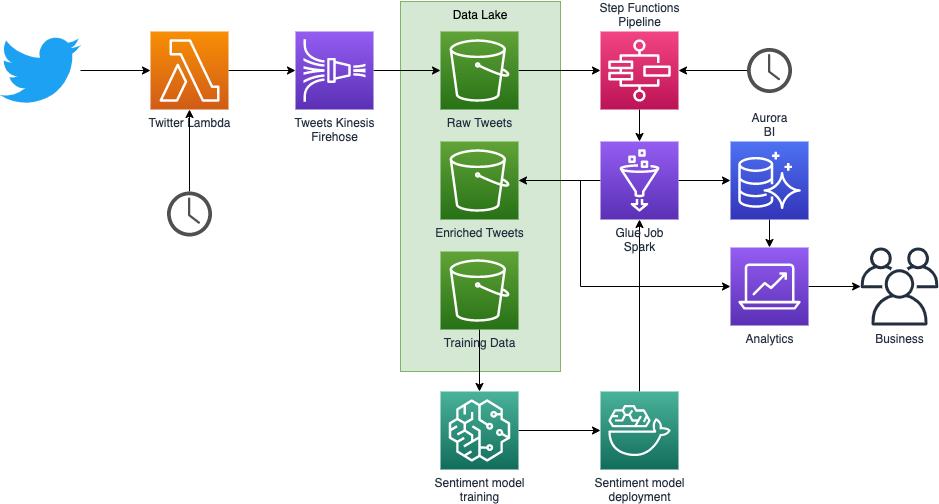

# aws-cdk-twitter-sentiment

Twitter posts and Sentiment model pipeline using [AWS Cloud Development Kit (CDK)](https://aws.amazon.com/cdk/). The code is used to showcase a serverless approach to Data Engineering and Machine Learning in AWS. The ideas can be applied to other cloud environments as well, though, not directly.

Codes are mostly written in Python 3.7+. Infrastructure codes are written in TypeScript, as it was more mature and usable at the moment of writing this code; also, the type system seems to go better with AWS CDK.

## Architecture

The architecture used in this example is presented on the below diagram



The state of completeness of the following elements of the of the architecture (ticked if done):

- [x] Twitter Lambda
- [x] Kinesis Firehose to S3
- [ ] State Machine Pipeline triggering
- [ ] Spark Tweets ETL on Glue Jobs
- [ ] BI Database in Aurora
- [ ] BI Analytics Dashboard
- [ ] Sentiment Model Training
- [ ] Sentiment Model Deployment

## Repository structure

The repository is structured as follows:

* `diagrams\` - the diagrams used in the documentation
* `infrastructure\` - AWS CDK TypeScript codes for the infrastructure deployment and update
* `notebooks\` - analytical notebooks showcasing data and basic analysis 
* `twitter` - codes for data collection from Twitter

## Setup

### Python

Mostly the code is written in Python 3.7+, hence, it is best to use your favorite Python distribution [PyEnv](https://github.com/pyenv/pyenv) or [Anaconda](https://www.anaconda.com/products/individual).

Create a local Virtual Environment with the commend:

```bash
python -m venv ./venv
source ./venv/bin/activate
```

All code elements have `requirements.txt` and sometimes `requirements_dev.txt`, which needs to be installed via `pip` as follows, e.g:

```bash
cd twitter
# dev will instal both deployment and development requirements
pip install -r requirements-dev.txt
```

Most of the testing is done in [pytest](https://docs.pytest.org/en/stable/), which is installed with the appropriate requirements file.

### AWS CDK

Remember that before working with AWS you need to have [AWS CLI](https://aws.amazon.com/cli/) installed and configured.

For AWS CDK you need to have [Node.JS](https://nodejs.org/) with NPM installed; see the manual for your operating system.

Also, for code requirements and Lambda deployment you may need [Docker](https://www.docker.com/); see their site for appropriate version.

To install AWS CDK CLL tool, as described in [the manual](https://docs.aws.amazon.com/cdk/latest/guide/getting_started.html) use command:

```bash
npm install -g aws-cdk
# To verify the installation use
cdk --version
```

The command is installed globally, so it can be used in any project.

## Deployment

To deploy the infrastructure go to `infrastucture` directory and use command:

```bash
cd infrastructure/
cdk deploy
```

You will be prompted about the deployment; you may use command to suppress that; see the help e.g. via `cdk -h`.

The stack is created in Cloud Formation, where you can see all the events and resources created, and see all the messages if anything goes wrong.

Note that, the infrastructure creates elements that run periodically; you may want to disable them or destroy the stack. 

To destroy the stack use command:

```bash
cdk destroy
```

Note that, if you have some data in S3 bucker, the destroy command will not be able to remove it and will throw and error; in this case, empty the bucket and try again.